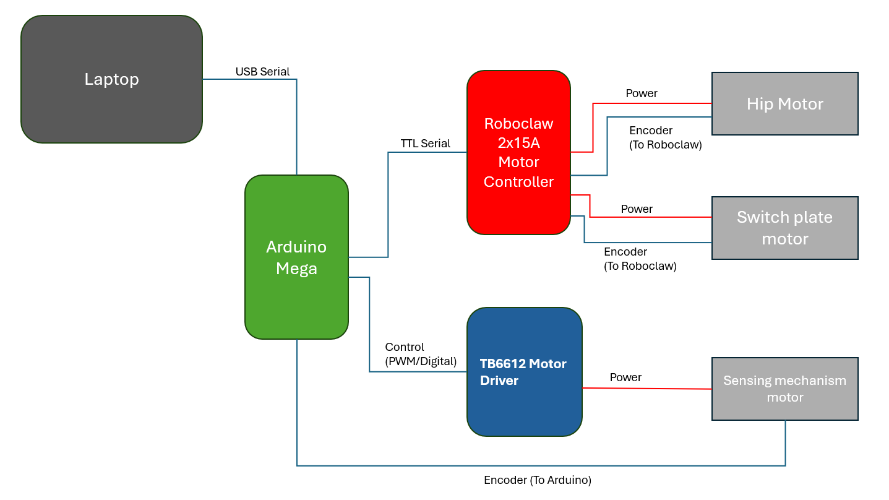

# Sole-Mates: Surface Adaptive Feet For Enhanced Locomotion
This repository accompanies a course project for 24-775 Bioinspired Robot and Experimentation

## Overview
This project develops an experimental test rig to evaluate terrain-adaptive foot design for legged robots. The system enables automatic switching between interchangeable foot soles based on detected surface type, allowing controlled comparison across different terrains, including wet acrylic, wood, and gravel.

The goal is to investigate whether adapting foot properties to surface conditions can improve locomotion efficiency compared to a single, non-adaptive foot design.

## System Architecture
- **Arduino Mega**: High level control logic and communication
- **RoboClaw Motor Controller**: Controls hip motor and sole switching motor. Comes with built in encoder support and PID controller.
- **TB6612 Motor Dtiver**: Drives the terrain sensing mechanism motor using PWM and digital control signals from the Arduino; control is implemented in software on the Arduino (no on-board PID).
- **Laptop**: Runs terrain classification algorithm

## Setup
### Arduino Programs

This repository includes two separate Arduino programs for different operating modes:

#### 1. Manual Foot Switching (`manual_mode.ino`)
- Upload this program to the Arduino for manual control of the sole-switching mechanism
- Used for testing, debugging, and validation of the mechanical system

**Controls**
| Key | Function |
|-----|----------|
| `a` | Start continuously walking |
| `b` | Rotate switch plate 120 deg |
| `c` | Rotate switch plate 240 deg|
| `s` | Check status |
| `0` | Switch to sole 1 |
| `1` | Switch to sole 2 |
| `2` | Switch to sole 3 |

#### 2. Automatic Foot Switching (`auto_mode.ino`)
- Upload this program to enable terrain-adaptive operation
- Requires the terrain classification python code running on the laptop
- The Arduino receives terrain information via serial communication and switches soles accordingly

### Terrain Classification Python Code
(to be completed)